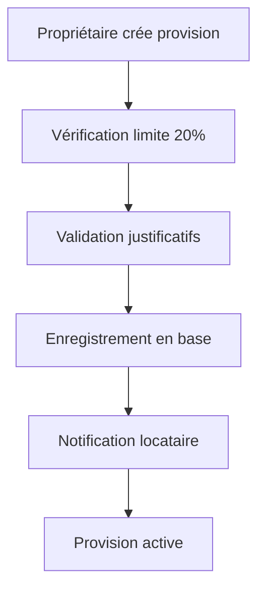
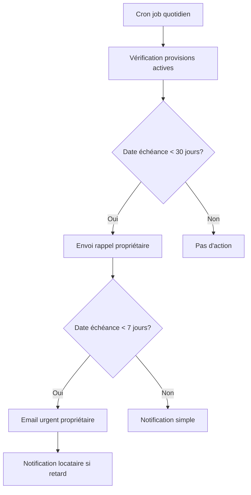
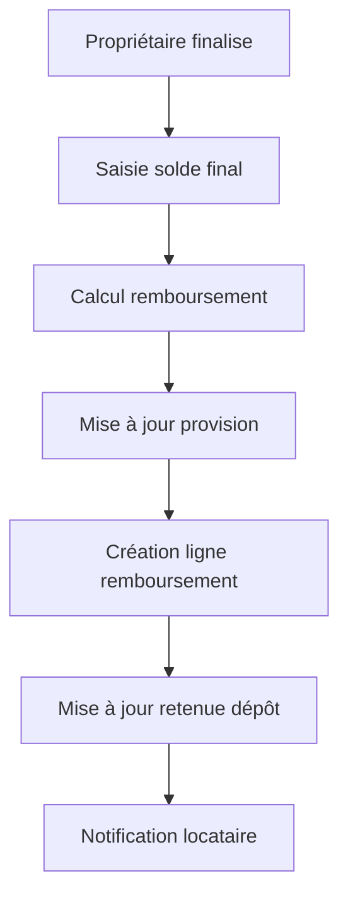

# Workflow de Gestion des Provisions de Charges

## Vue d'ensemble

Ce document décrit le workflow complet pour la gestion des provisions de charges dans le système de restitution de dépôt de garantie, conforme à la loi du 6 juillet 1989.

## Fonctionnalités implémentées

### 1. Création de provisions
- **Limite légale** : Maximum 20% du dépôt de garantie
- **Justification obligatoire** : Documents justificatifs requis
- **Date d'échéance** : Date prévue d'approbation des comptes de l'immeuble
- **Notifications automatiques** : Le locataire est notifié de la création

### 2. Suivi et rappels
- **Rappels automatiques** : 30 jours avant l'échéance
- **Alertes urgentes** : 7 jours avant l'échéance
- **Notifications de retard** : Si la date d'échéance est dépassée
- **Emails automatiques** : Aux propriétaires pour les cas urgents

### 3. Finalisation
- **Régularisation définitive** : Connexion avec le système de régularisation existant
- **Calcul automatique** : Montant à rembourser = Provision - Solde final
- **Remboursement** : Intégration dans le système de restitution
- **Notifications** : Le locataire est informé du remboursement

## Architecture technique

### Tables de base de données

#### `charge_provisions`
```sql
- id: UUID (clé primaire)
- lease_id: UUID (référence vers leases)
- retention_id: UUID (référence vers deposit_retentions, optionnel)
- provision_amount: DECIMAL(10,2) (montant de la provision)
- max_allowed_amount: DECIMAL(10,2) (20% du dépôt)
- deposit_amount: DECIMAL(10,2) (montant du dépôt de garantie)
- supporting_documents: JSONB (justificatifs)
- justification_notes: TEXT (justification)
- provision_date: DATE (date de création)
- expected_finalization_date: DATE (date prévue d'approbation)
- status: VARCHAR(20) ('active', 'finalized', 'refunded')
- finalization_date: DATE (date de finalisation)
- final_regularization_id: UUID (référence vers charge_regularizations_v2)
- final_balance: DECIMAL(10,2) (solde final des charges)
- refund_amount: DECIMAL(10,2) (montant à rembourser)
```

### API Endpoints

#### `GET /api/leases/[id]/charge-provisions`
Récupère toutes les provisions pour un bail donné.

#### `POST /api/leases/[id]/charge-provisions`
Crée une nouvelle provision de charges.

#### `POST /api/leases/[id]/charge-provisions/finalize`
Finalise une provision avec les données de régularisation.

#### `GET /api/cron/charge-provision-reminders`
Cron job pour envoyer les rappels automatiques.

### Composants React

#### `ChargeProvisionManager`
- Interface de gestion des provisions
- Affichage des provisions actives et de l'historique
- Dialog de finalisation avec calcul automatique
- Intégration avec le système de notifications

#### `DepositRetentionManager` (mis à jour)
- Section dédiée aux provisions de charges
- Calcul automatique des totaux incluant les provisions
- Sauvegarde persistante des données

## Workflow détaillé

### 1. Création d'une provision



### 2. Rappels automatiques



### 3. Finalisation



## Conformité légale

### Article 22 de la loi du 6 juillet 1989
- ✅ Limite à 20% du dépôt de garantie
- ✅ Justification par documents
- ✅ Délai de régularisation dans le mois suivant l'approbation
- ✅ Possibilité d'accord pour solder immédiatement

### Notifications obligatoires
- ✅ Information du locataire lors de la création
- ✅ Rappels automatiques au propriétaire
- ✅ Notification de finalisation et remboursement

## Configuration et déploiement

### 1. Exécution des scripts SQL
```bash
# Créer les tables
psql -f scripts/create-deposit-retentions-table.sql

# Configurer les rappels
psql -f scripts/setup-charge-provision-cron.sql
```

### 2. Configuration du cron job
Ajouter dans votre planificateur de tâches :
```bash
# Rappels quotidiens à 9h
0 9 * * * curl -X GET https://votre-domaine.com/api/cron/charge-provision-reminders
```

### 3. Variables d'environnement
```env
NEXT_PUBLIC_APP_URL=https://votre-domaine.com
```

## Monitoring et maintenance

### Statistiques disponibles
- Vue `charge_provision_stats` pour les métriques globales
- Fonctions de vérification des provisions en retard
- Fonction de nettoyage des anciennes provisions

### Alertes recommandées
- Provisions en retard de plus de 30 jours
- Provisions non finalisées après 1 an
- Erreurs dans l'envoi des rappels

## Tests et validation

### Tests unitaires recommandés
- Validation des limites légales (20% max)
- Calculs de remboursement
- Envoi des notifications
- Intégration avec le système de régularisation

### Tests d'intégration
- Workflow complet de création à finalisation
- Rappels automatiques
- Notifications email et in-app
