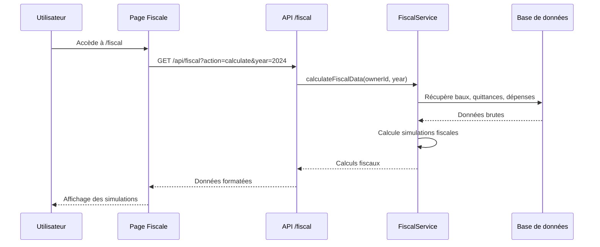
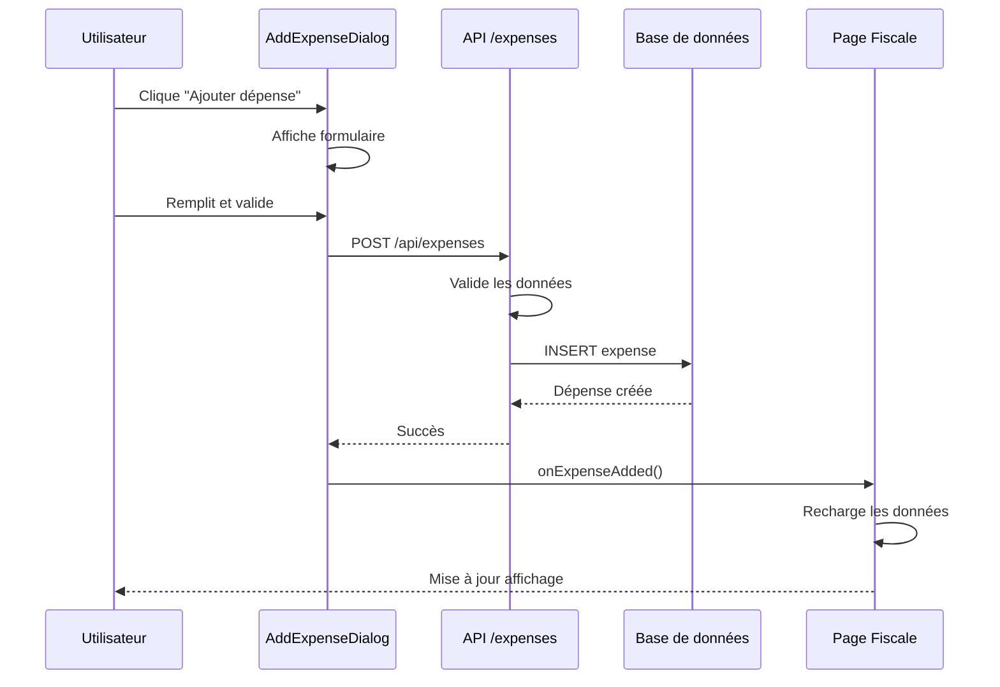
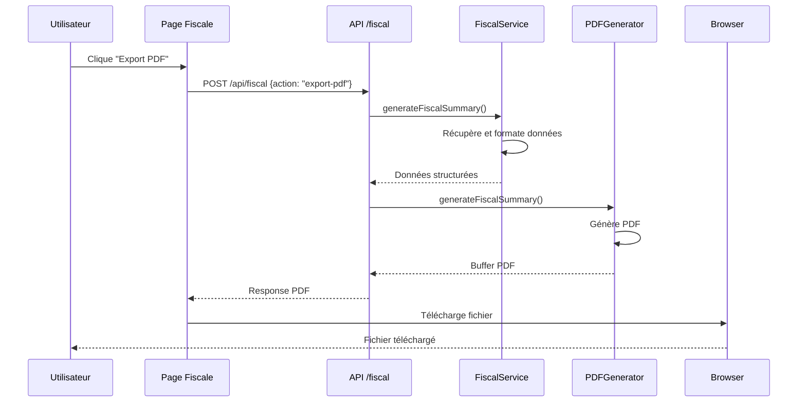

# Architecture de la Déclaration Fiscale

## Vue d'ensemble

La fonctionnalité de déclaration fiscale est organisée en plusieurs couches :

```
┌─────────────────────────────────────────────────────────────┐
│                    COUCHE PRÉSENTATION                     │
├─────────────────────────────────────────────────────────────┤
│  Page Fiscale  │  Composants UI  │  Dialogues  │  Forms    │
│  /fiscal       │  - SummaryCard  │  - AddExpense│  - 2044   │
│                │  - Simulation   │  - ViewExpense│  - 2042-C │
│                │  - Breakdown    │             │           │
└─────────────────────────────────────────────────────────────┘
┌─────────────────────────────────────────────────────────────┐
│                    COUCHE LOGIQUE MÉTIER                   │
├─────────────────────────────────────────────────────────────┤
│  FiscalCalculator  │  FiscalService  │  PDFGenerator       │
│  - Calculs fiscaux │  - Données DB   │  - Récapitulatifs   │
│  - Simulations     │  - API calls    │  - Formulaires      │
│  - Recommandations │  - Validation   │  - Exports          │
└─────────────────────────────────────────────────────────────┘
┌─────────────────────────────────────────────────────────────┐
│                    COUCHE DONNÉES                          │
├─────────────────────────────────────────────────────────────┤
│  API Routes        │  Base de données                      │
│  - /api/fiscal     │  - expenses (dépenses)                │
│  - /api/expenses   │  - charge_regularizations             │
│  - /api/fiscal/forms│  - leases (baux)                     │
│                    │  - rent_receipts (quittances)         │
│                    │  - properties (biens)                 │
└─────────────────────────────────────────────────────────────┘
```

## Flux de données

### 1. Chargement des données fiscales



### 2. Ajout d'une dépense



### 3. Génération de documents



## Composants principaux

### FiscalCalculator

**Responsabilité** : Logique de calcul fiscal pure

```typescript
class FiscalCalculator {
  // Calculs de base
  calculateTotalRentCollected(receipts, year)
  calculateRecoverableCharges(receipts, year)
  calculateDeductibleExpenses(expenses, year)
  
  // Simulations fiscales
  calculateMicroFoncier(grossIncome)
  calculateMicroBIC(grossIncome)
  calculateRealRegime(grossIncome, expenses)
  
  // Recommandation
  recommendRegime(microFoncier, microBIC, realRegime)
}
```

### FiscalService

**Responsabilité** : Orchestration des données et API

```typescript
class FiscalService {
  // Récupération des données
  getFiscalData(ownerId, year)
  getAvailableYears(ownerId)
  getFiscalStats(ownerId)
  
  // Calculs
  calculateFiscalData(ownerId, year)
  
  // Exports
  exportFiscalDataCSV(ownerId, year)
  generateFiscalSummary(ownerId, year)
}
```

### Composants UI

#### FiscalSummaryCard
- Affiche le résumé fiscal annuel
- Montre revenus, charges, dépenses
- Boutons d'action

#### FiscalSimulationCard
- Affiche les 3 simulations fiscales
- Met en évidence la recommandation
- Boutons de génération de formulaires

#### ExpenseBreakdownCard
- Détail des dépenses par catégorie
- Gestion des dépenses déductibles/non déductibles
- Tableaux interactifs

#### AddExpenseDialog
- Formulaire d'ajout de dépense
- Validation en temps réel
- Calcul automatique de la déductibilité

## Structure des données

### FiscalCalculation

```typescript
interface FiscalCalculation {
  // Données de base
  totalRentCollected: number
  totalRecoverableCharges: number
  totalDeductibleExpenses: number
  
  // Simulations
  microFoncier: {
    applicable: boolean
    grossIncome: number
    deduction: number
    taxableIncome: number
  }
  microBIC: { /* ... */ }
  realRegime: { /* ... */ }
  
  // Recommandation
  recommendation: {
    regime: "micro-foncier" | "micro-bic" | "real"
    reason: string
    savings: number
  }
}
```

### Expense

```typescript
interface Expense {
  id: string
  owner_id: string
  property_id: string
  lease_id?: string
  type: "incident" | "maintenance" | "annual_charge"
  category: "repair" | "maintenance" | "improvement" | "tax" | "insurance" | "interest" | "management"
  amount: number
  date: string
  description: string
  deductible: boolean
  receipt_url?: string
}
```

## API Endpoints

### GET /api/fiscal
- `?action=calculate&year=2024` : Calcul complet
- `?action=stats` : Statistiques globales
- `?action=years` : Années disponibles
- `?action=summary&year=2024` : Récapitulatif détaillé

### POST /api/fiscal
- `{action: "export-csv", year: 2024}` : Export CSV
- `{action: "export-pdf", year: 2024}` : Export PDF

### POST /api/fiscal/forms
- `{formType: "2044", year: 2024}` : Formulaire 2044
- `{formType: "2042-C-PRO", year: 2024}` : Formulaire 2042-C-PRO

### CRUD /api/expenses
- GET : Liste des dépenses (avec filtres)
- POST : Création d'une dépense
- PUT : Modification d'une dépense
- DELETE : Suppression d'une dépense

## Sécurité

### Authentification
- Toutes les API vérifient l'authentification Supabase
- Les données sont filtrées par `owner_id`

### Validation
- Validation des montants (positifs)
- Validation des dates (pas dans le futur)
- Validation des types et catégories

### Autorisation
- Seul le propriétaire peut voir ses données
- Pas d'accès croisé entre propriétaires

## Performance

### Optimisations
- Index sur les colonnes fréquemment utilisées
- Requêtes optimisées avec jointures
- Mise en cache côté client

### Limitations
- Calculs synchrones (pour V1)
- Pas de pagination sur les dépenses
- PDF généré côté serveur

## Tests

### Tests unitaires recommandés
- `FiscalCalculator` : Logique de calcul
- `FiscalService` : Récupération des données
- `PDFGenerator` : Génération de documents

### Tests d'intégration
- API endpoints
- Flux complet utilisateur
- Validation des données

## Déploiement

### Prérequis
- Migration de la base de données
- Installation des dépendances PDF
- Configuration des variables d'environnement

### Migration
```bash
# 1. Exécuter la migration
node scripts/run-expenses-migration.js

# 2. Vérifier les tables
# Vérifier dans Supabase que les tables sont créées

# 3. Tester la fonctionnalité
# Accéder à /owner/rental-management/fiscal
```

## Monitoring

### Métriques importantes
- Nombre de calculs fiscaux par jour
- Taux d'erreur des API
- Temps de génération des PDF
- Utilisation des exports

### Logs
- Erreurs de calcul fiscal
- Échecs de génération PDF
- Tentatives d'accès non autorisées
